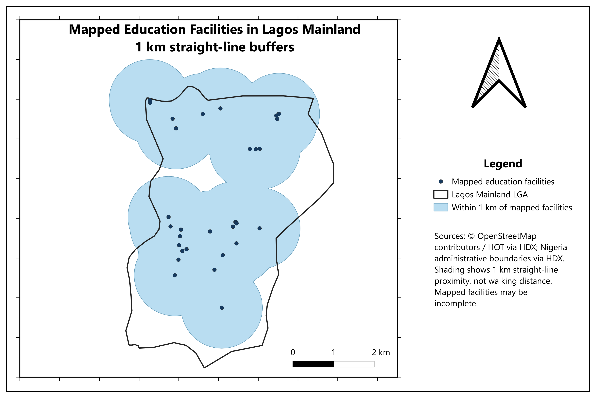

# Mapping Schools and Education Facilities in Lagos Mainland LGA

A GeoDev Lab Africa project using OpenStreetMap education records and administrative boundaries to explore education facility locations in Lagos Mainland, Lagos State, Nigeria.

## Project question and scope

My original Week 1 question was:

**Where are the schools recorded in OpenStreetMap located within Lagos Mainland Local Government Area?**

The project began with school mapping. During data inspection, I found that the education dataset also included colleges, universities and education-related buildings. The Month 1 analysis therefore retains these broader education records, with their classification limitations documented.

Week 4 extended the location question by asking:

**Which parts of Lagos Mainland lie within 1 km straight-line distance of the mapped education records in my prepared dataset?**

The interactive school map proposed in Week 1 remains a future goal. The completed Month 1 output is a QGIS project, prepared spatial data, a buffer analysis and a static result map.

## What the project found

The prepared OpenStreetMap education records are unevenly distributed across Lagos Mainland. The map shows clusters in the northern and southern portions of the LGA, with fewer mapped locations in some areas between and around them.

The 1 km buffers overlap around these clusters, while gaps remain inside the LGA boundary. Those gaps are outside the buffers of the records included in this analysis; they do not prove that no schools or other education facilities exist there.

The prepared dataset contains **31 education features: 16 points and 15 polygons**. Of these, **24 records carry the school amenity tag**: 14 points and 10 polygons. These are record counts, not verified counts of unique schools. Some school-tagged records require classification review, and different geometries may represent the same institution.

The Week 4 analysis used all 31 education records, not just the school-tagged subset.

## Four weeks of work

| Week | What I did | Open the work |
| --- | --- | --- |
| Week 1 | Defined the school-location question, selected Lagos Mainland and identified both datasets and their sources. | [Project brief](project-brief.md) |
| Week 2 | Downloaded and inspected the datasets, extracted local features and documented counts, attributes and limitations. | [Data notes](data-notes.md) |
| Week 3 | Clipped the education polygons, reprojected the layers and recorded five quality checks. | [Preparation and quality checks](week3-data-preparation.md) · [Analysis-ready data](lagos_mainland_analysis_ready.gpkg) |
| Week 4 | Created and checked 1 km buffers, dissolved a copy for display and exported the result map. | [Month 1 summary](month-1-summary.md) · [Map image](lagos_mainland_education_1km.png) · [Buffer analysis output](education_buffers_1km.gpkg) · [Dissolved buffers](education_coverage_1km.gpkg) |

## Result map

Dark points represent the mapped input locations. The black outline shows Lagos Mainland LGA. Blue shading represents the dissolved 1 km buffers.

Buffers extend beyond the LGA boundary because the buffer output was not clipped.

## How the work developed

### Week 1: Define the question and identify data

I downloaded the Nigeria education facilities dataset and Nigeria LGA boundaries.

An initial attribute-based inspection found 35 education records labelled Lagos Mainland, including 28 tagged as schools. These were preliminary counts based on the stored administrative label.

Both dataset source links are recorded in the project brief.

### Week 2: Extract and understand the local data

I selected the Lagos Mainland boundary, with LGA code NG025015.

Using Extract by Location with the intersect predicate, I obtained:
- 16 education points.
- 15 education polygons.
- 1 Lagos Mainland boundary feature.

The education polygons were retained whole at this stage. The local outputs used EPSG:4326.

The count changed from 35 to 31 because Week 1 used administrative labels, while Week 2 used spatial intersection. These selection methods answer different questions.

Three intersecting polygons carried a Mushin administrative label. Missing names, uncertain classifications and possible institution-level duplication were documented.

### Week 3: Prepare the data and check its quality

I clipped the education polygons to Lagos Mainland and reprojected the boundary, points and polygons to **EPSG:32631 — WGS 84 / UTM zone 31N**, which uses metres.

I saved the prepared layers in `lagos_mainland_analysis_ready.gpkg`:
- `boundary_utm31n`: 1 feature.
- `education_points_utm31n`: 16 features.
- `education_polygons_utm31n`: 15 features.

I recorded five quality checks:
1. CRS: all prepared layers and the project used EPSG:32631.
2. Geometry validity: 16 valid points and 15 valid polygons, with no invalid features or errors reported.
3. Duplicate geometry: no exact duplicate geometries were found.
4. Missing attributes: 2 points and 6 polygons had missing names; other missing values were flagged.
5. Extent and coverage: the prepared features were within the study boundary, but OSM completeness remained uncertain.

No exact duplicate geometries does not mean that every record represents a different institution. Clipping also does not rewrite administrative labels such as Mushin.

### Week 4: Analyse proximity

I created one representative point for each of the 15 polygons using Point on Surface, then merged these with the 16 existing points.

Using the resulting 31 records, I ran Buffer with:
- Distance: 1,000 metres.
- Segments: 25.
- Dissolve: disabled.

Before running it, I expected 31 buffers, approximately 1,000 m radii, overlaps around nearby facilities and no empty geometries.

I checked the result four ways:
1. Visually inspected the buffers against the input points and boundary.
2. Confirmed 31 output features, matching the expected count.
3. Manually checked one point-to-buffer-edge distance at approximately 1,000 m.
4. Checked for empty or null geometry; 0 features were selected.

I retained the original buffers and dissolved a separate copy for clearer map presentation.

## Data and project files

### Original datasets
- [Nigeria education facilities](data/education_facilities.gpkg)
- [Nigeria LGA boundaries](nga_admin2.geojson)

### Week 2 local extracts
- [Lagos Mainland boundary](lagos_mainland_boundary.gpkg)
- [Education points](lagos_mainland_education_points.gpkg)
- [Education polygons](lagos_mainland_education_polygons.gpkg)

### Week 3 prepared data
- [Analysis-ready GeoPackage](lagos_mainland_analysis_ready.gpkg)

### Week 4 analysis
- [Polygon representative points](education_polygon_points_utm31n.gpkg)
- [Combined input points](education_all_points_utm31n.gpkg)
- [Original 1 km buffers](education_buffers_1km.gpkg)
- [Dissolved buffer display](education_coverage_1km.gpkg)
- [Exported map](lagos_mainland_education_1km.png)
- [Month 1 summary](month-1-summary.md)

### QGIS project
- [Open the project file](lagos-mainland-schools.qgz)

To use the project locally, download and extract the repository, keep its folder structure intact, and open the QGIS project.

## Data sources

- Education facilities: [OpenStreetMap contributors, distributed by HOT through HDX](https://data.humdata.org/dataset/hotosm_nga_education_facilities).
- Administrative boundaries: [Nigeria Subnational Administrative Boundaries on HDX](https://data.humdata.org/dataset/cod-ab-nga).

## Limitations and next steps

The analysis describes the available OSM records, not a complete or verified inventory of schools.

The 1 km distance is an exploratory threshold, not an official access standard. It measures straight-line proximity, not walking distance or travel time. Representative points from polygons are not verified entrances.

Facilities outside Lagos Mainland were not included, even though they could serve people inside it. No percentage of land or population covered has been calculated.

## Month 2: development environment and early Python

Week 5: set up Python, VS Code and the terminal. hello.py runs.

Week 6: set up the project with uv and added pandas. check.py prints the pandas version.
